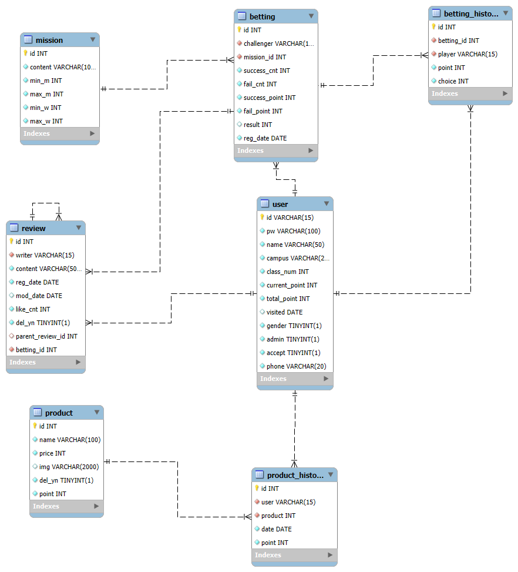
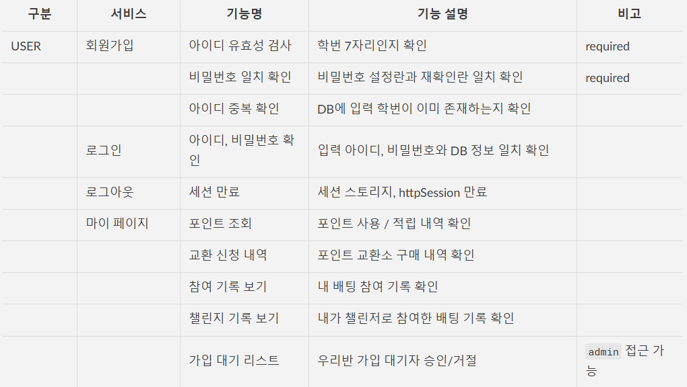
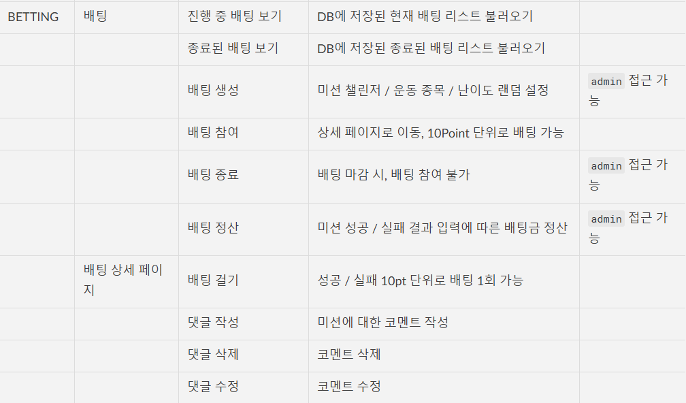
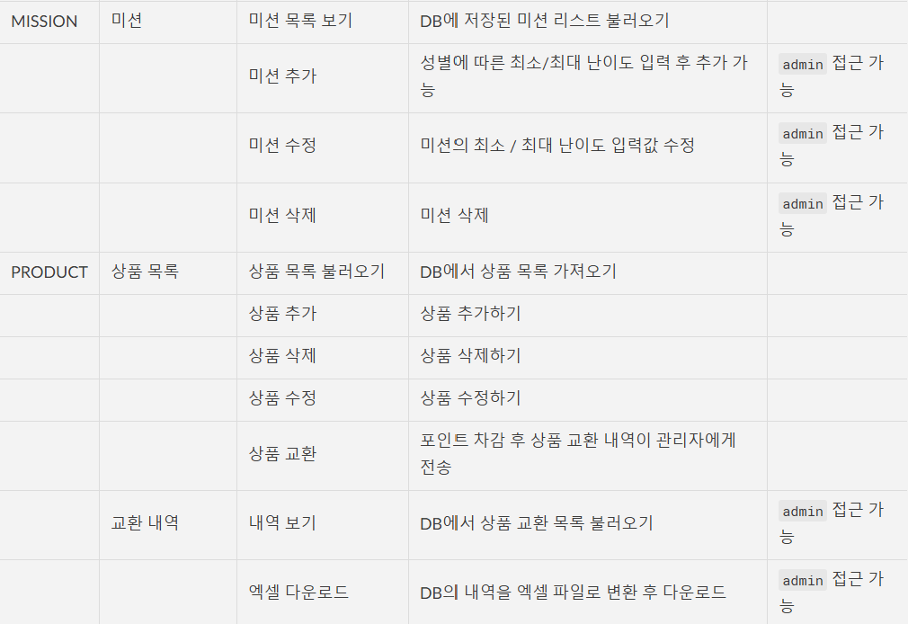
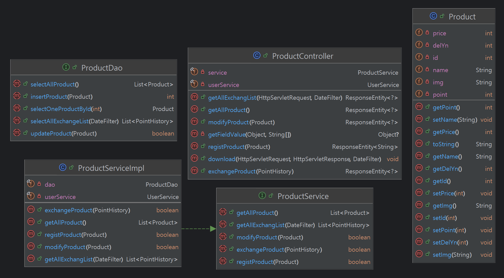
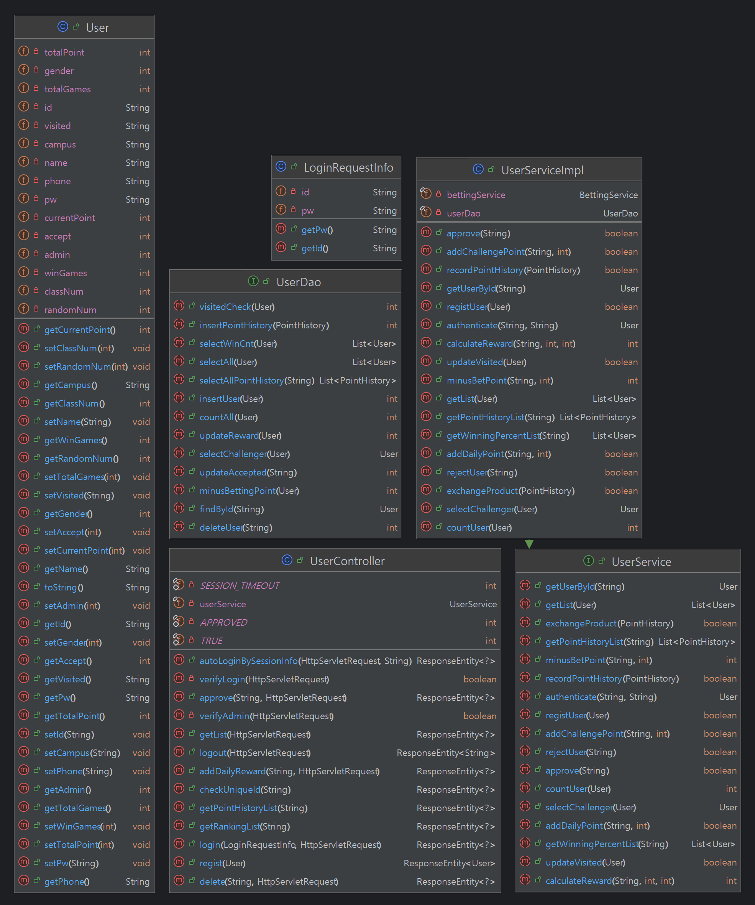
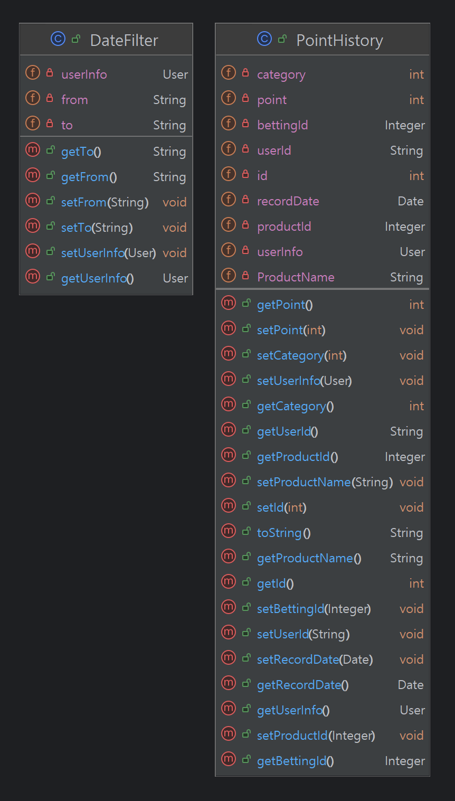
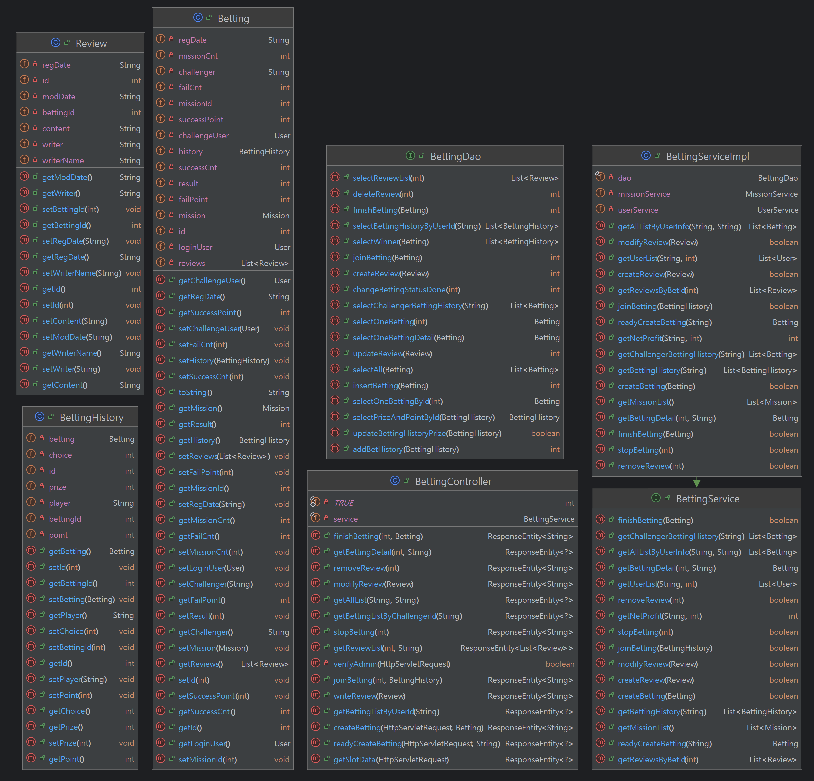
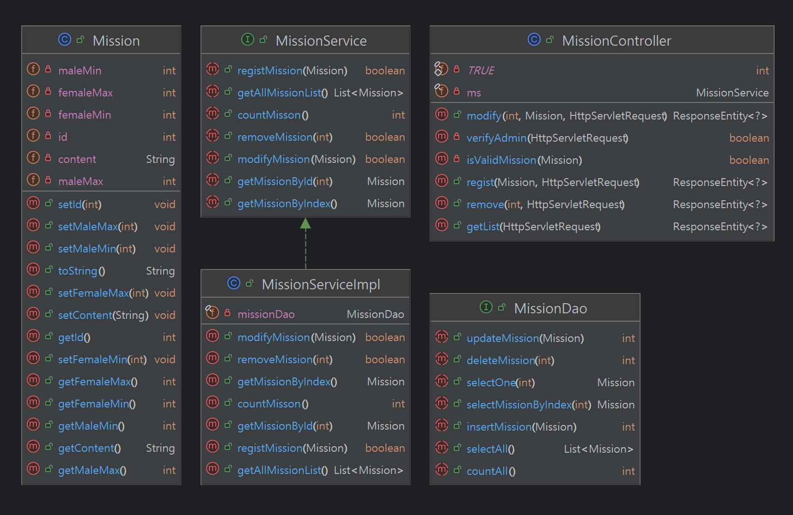
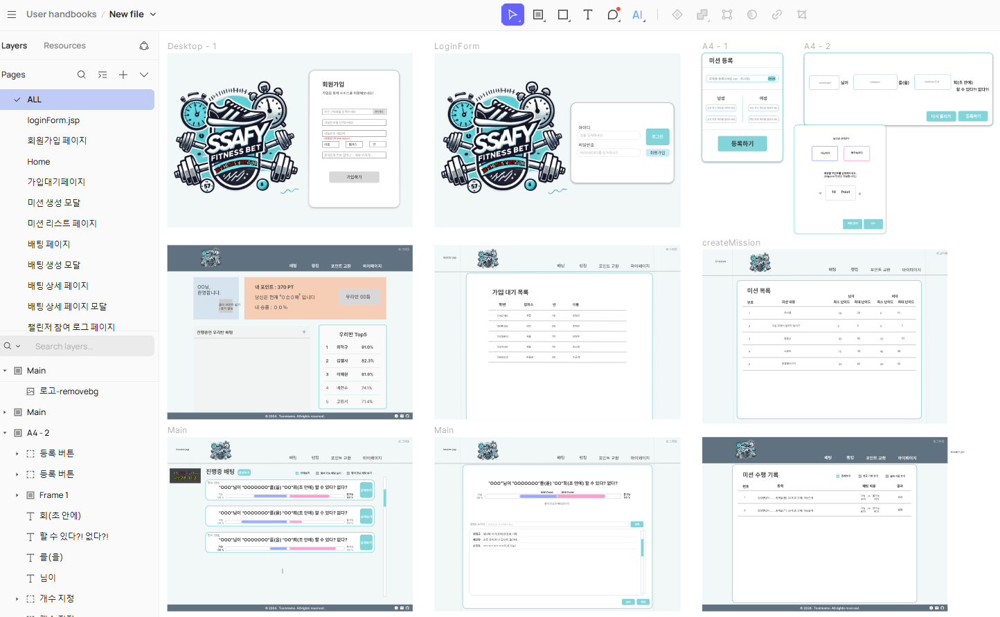

# Final_PJT_소현_혁규

## 데이터베이스 설계 규칙

- **테이블명 규칙**: 모든 데이터베이스 테이블 이름은 대문자를 사용합니다. 예를 들어, `EMPLOYEES`, `DEPARTMENTS` 등으로 명명합니다.

## 커밋 규칙

**커밋 메시지**는 다음과 같은 구조를 따릅니다:

1. **제목/요약**: 변경사항의 요약은 명령문 형태로 작성하며, 첫 글자는 대문자를 사용합니다.
2. **본문**: 필요한 경우, 변경사항에 대한 상세한 설명을 본문에 추가합니다. 
3. **카테고리 태그**: 커밋의 성격을 나타내는 태그를 포함시킵니다:
   - `[feat]`: 새로운 기능
   - `[fix]`: 버그 수정
   - `[modify]`: 비즈니스 로직 변경
   - `[docs]`: 문서 관련
   - `[test]`: 테스트
   - `[etc]`: 기타 변경 사항

### 커밋 메시지 예시

`feat : login 기능 추가`
`본문`
`사용자 인증 기능 추가 / 비밀번호 찾기 기능 추가`
<br>
<br>

## 프로젝트 주제 선정 이유

**9 to 6** 공부로 계속되는 **신체 정적 피로**의 누적..
간단히 즐길 수 있는 실내 레크리에이션의 **부재**로 <br>
**FITNESS BET**을 이용한 아이스 브레이킹과 <br>
**신체적 피로 해소 및 정신적 활력 회복**으로 
**긍정적인 학습 환경 조성**을 기대할 수 있을 것이라 생각되어 주제를 선정

<br>

## 역할 분담
### 김소현
- **풀스택**
   - 프로토타입 디자인
   - 배팅 CRU
      - 배팅 생성 시 slot머신 
      - 배팅 코맨트 CRUD
      - 배팅 참여, 마감, 결과 입력
      - 배팅 참여 기록, 챌린저 기록
   - 포인트 교환소 CRUD
      - 상품 교환 내역 기록 및 엑셀 다운 기능

### 최혁규
- **풀스택**
   - 프로토타입 디자인
   - 유저 로그인 / 회원가입
   - 미션 CRUD
   - 유저 랭킹 

<br>

## 사용 스택
- Language / IDE : Spring Boot, MyBatis, Vue.js, Pinia, axios, VSCode, STS
- 서비스 : MYSQL, REST API, Git & GitHub
- 배포 / 협업 : cloudtype, netlify, Notion, Mattermost, Google Sheets, Creatie

## ERD
<div style="text-align: center;">
    
</div>

## 기능명세서




## UML






## Prototype


## DDL 
[DDL.sql](./assets/sql/DDL.sql)

<br>

## 생각하기
#### 유저의 참여를 독려할 수 있는 방안이 뭐가 있을까..?
- **참여 독려를 위한 방안** : **학급비** 사용을 전제 하에 유저들은 <br>
데일리 출석 포인트, 배팅 정산 포인트, 미션 도전 포인트를 모아 <br>
**포인트 교환소**에서 음료 쿠폰을 교환 가능

<br>

## 골치 아팠던 오류 ##
1. 응답에 세션 쿠키가 포함되지 않던 오류<br>
   백에서의 모든 로직에서 session에 대한 정보를 출력했을 때 잘 나왔는데
   프론트로 보내는 요청에 세션 쿠키가 포함되지 않아 로그인에 대한 기능이 실행되지 않았다.
   서버와 클라이언트의 설정을 점검하여
   `@CrossOrigin(origins = "http://your-client-domain", allowCredentials = "true")`
   `axios.defaults.withCredentials = true;` 를 추가하여 오류를 해결했다.
2. BE의 session과 FE의 sessionStorage의 차이에 대한 이해도 부족으로 인해 값을 제대로 넘겨주지 않아 생긴 오류<br>
   BE에서는 session에 유저 정보를 저장하고 FE에서는 로그인 후 sessionStorage에 로그인 유저 정보를 저장하여 사용
3. 새로고침 했을 때, 로그인 세션이 유지되지 않던 오류<br>
로그인 시, 프론트의 세션 스토리지에 유저 id를 저장하고 백 세션의 유저 id 값과 세션 스토리지 유저 id 값이 같으면 `userStore`에 loginInfo 객체에 로그인 정보를 다시 저장하도록 구현하여 해결했다.

<br>

## 후기

### 김소현
- 느낀점
   - 이것저것 많은 내용을 담고 싶어 여러가지 기능을 계획했는데 짧은 기간동안 계획한 기능을 전부 구현하게 되어 뿌듯하고, 서로의 의견을 잘 반영한 것 같다.
   - 기능이 많아도 디자인, **프론트가 중요**하다는 생각이 들었다. 완성도 높은 UI를 위해..
   - 프로젝트를 진행하며 BE 컨트롤러에서 사용하는 어노테이션, API method 별 사용 가능한 값에 대한 이해도를 높일 수 있었다.
   - 프론트 / 백으로 역할을 나눈 것이 아니라 기능별로 나눠 진행했는데, 백과 프론트 사이의 이해도가 증가한 것 같아 좋았다. FE/BE로 나눴으면 시간이 좀 더 소요되었을 것 같다.
      - 아직 프론트와 백 모두 어떤 코드가 효율적인지 잘 모르겠다. 다양한 코드를 접해보고 싶다.
   - 혁규와 세션 관련 오류를 여러번 접하면서 많은 부분을 배울 수 있었던 것 같다. 백과 프론트의 세션 차이라던지,,
     
- 생각해보기
   - 배팅 마감 시 새로고침을 안해 배팅 참여 버튼이 활성화되어 있는 경우, 배팅 참여 요청 시 배팅의 상태를 확인한 후 참여 가능 여부가 결정되어 마감된 배팅에 참여할 수 없다는 알림을 전달하도록 구현. 만약 배팅 마감과 배팅 참여를 동시에 누른다면? 어떻게 처리할 것인가..
   - store에서 axios 요청을 모두 다루는 것이 좋은가, 한군데에서만 쓰면 해당 컴포넌트에서 사용하는 것이 좋은가
      - 깔끔한건 store에 다 넣어두는것인데 그럼 store가 너무 길어진다. 다른 곳에 모아둘 수 있나?
        
- 앞으로 디벨롭시키고 싶은점
   - ssafy 홈페이지처럼 동시에 두 군데에서 로그인 상태 유지 못하도록 구현하기
      - ex) PC 로그인 후 모바일 로그인 시 PC 로그아웃 처리
   - 중복되는 코드 리팩토링하기
      - ex) 진행중 배팅과 종료된 배팅의 틀은 거의 비슷함. 하나의 컴포넌트로 사용하고 props 등으로 넘긴 값으로 관리 할 수 있지 않을까?
   - view와 component 분리
      - 어떤 코드는 뷰에 작성하고, 어떤 코드는 컴포넌트에 작성해 뷰에 노출시켰는데 깔끔하게 리팩토링하고 싶다. 근데 어느정도까지 하는게 맞는지 잘은 모르겠다..

### 최혁규
- 느낀점
     - 항상 관통 PJT를 할때마다 느꼈지만, " **기획 단계가 가장 중요하구나..**"를 다시 각인시켰다. 필수적인 기능을 우선으로 하고 있으면 좋은.. 부가적인 기능들을 우선순위에서 내려놨었는데 모두 구현할 수 있게 되어 정말 알찬 프로젝트였다. 1학기 기간 중 최종 PJT 기간이 가장 재밌었다. 서로의 호흡도 중요하고 원활한 프로젝트을 위해 뛰어난 개발 실력보다 `일`과 `휴식`의 경계가 다름을 인정하는 것이 더 중요하다는 것을 느꼈다. 물론 엘사 누나는 뛰어난 개발 실력까지 겸비한 인재다.. `역시 누나야!`를 입에 달고 살았다. 그랬더니 편했다..ㅋㅋ
     -  예전에 교수님께서 프로젝트 6인의 백, 프론트 구성 비율이 프론트 4명, 백엔드 2명이라 하셨는데.. 정말 왜 그런지 깨달았다. 이번에는 모두 풀스택으로 진행하여 내가 맡은 부분에선 `params`는 내가 설정한 키 값으로 보내기 때문에 막힘 없었지만, 조금이라도 엮여 있는 부분이 있을 경우 서로의 코드와 흐름을 이해하면서 진행해야 했다. 그렇기에 Back 과 Front를 철저히 나눈 프로젝트에서는 서로의 원활한 소통이 제일 중요시 될 것 같다.
     -  Back의 httpSession의 세션 과 Front의 sessionStorage의 세션은 서로 다른 것..임을 배웠다. 분명 라이브 강의때 이 얘기를 들었는데 직접 몸소 느껴보니 확실히 이해가 되었다. 역시 뭐든 겪어봐야 아는구나.
     -  엘사 누나 실력을 보면 난 아직 참으로 부족함을 느꼈다. 그만큼 동기부여도 받았고, 종종 누나가 고민할 때 툭 던진 내 한마디가 해결책이 되었을 때 참 짜릿했다.
            - 근데 뭐였는지 기억이 안나..

- 생각해보기
   - Back 에서, dao의 메소드들을 통해 로직을 구현할 때, 어디까지 재활용을 해도 되는지..가 의문이다.
   - 이미 있는 dao를 활용해도 될 때, 코드 유지보수나, 인수인계를 생각하면 명확히 분리해서 따로 만드는 게 더 나을 것 같다는 생각이 드는데.. 이는 결국 불필요한 유사 (중복) 코드가 되지 않을까 하는 걱정도 든다.
        - 물론 정답은 없다고 하지만, 그 사이의 타협점을 찾는게 어려운 것 같다.

- 리팩토링
     - 프론트 실력이 부족해서 `pinia`의 store, `vue` component의 script 부분에 함수를 이리 저리 호출하고 중구난방으로 짰다.
          - 이건 내가 봐도 참 지저분하고 누가봐도 초보자가 오류 해결하기 급급해서 구성한 코드같아 보이니까.. 이 부분을 리팩토링해서 클린 코드로 만들고 싶다.
<br>

## 참고사항
### 배포 종료 이후 로컬에서 돌릴 때
`application.properties`에서 
```
spring.datasource.url=jdbc:mysql://svc.sel4.cloudtype.app:32211/fitnessbet?serverTimezone=UTC
spring.datasource.username=root
를 주석 처리 하고
#spring.datasource.url=jdbc:mysql://localhost:3306/fitnessbet?serverTimezone=UTC
#spring.datasource.username=ssafy
를 주석 해제
```
### FE 배포 주소
[FitnessBET](https://dainty-nasturtium-7e1f9b.netlify.app/)
